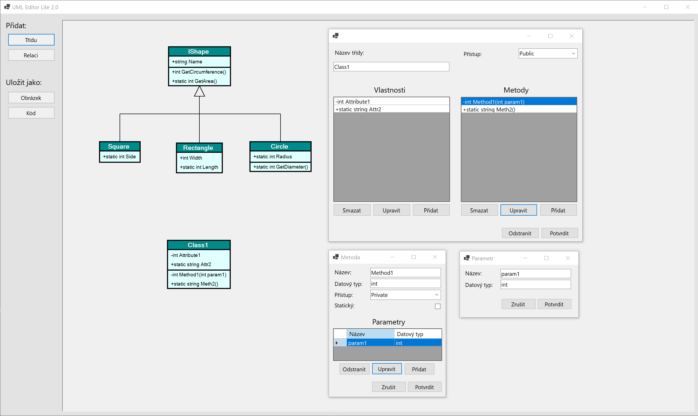
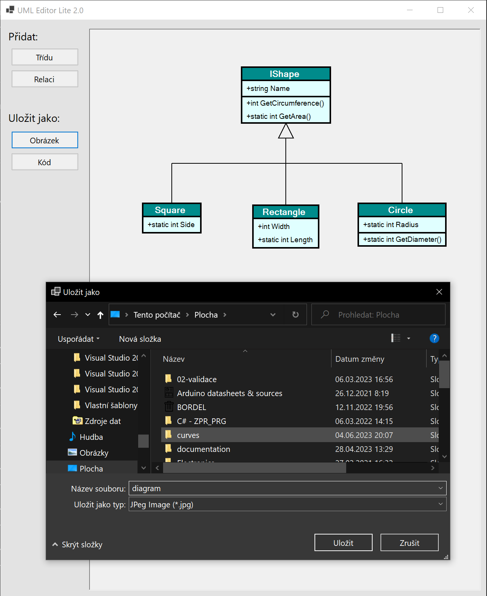

# UMLEditor2.0

A simple UML diagram editor made at school to practice .NET Forms   

you can add classes, create relations between them and than export the diagram to either an image or C# code

    

